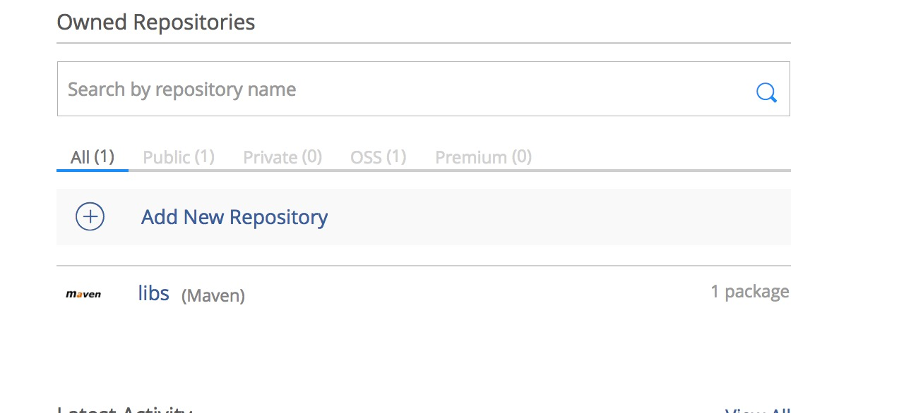
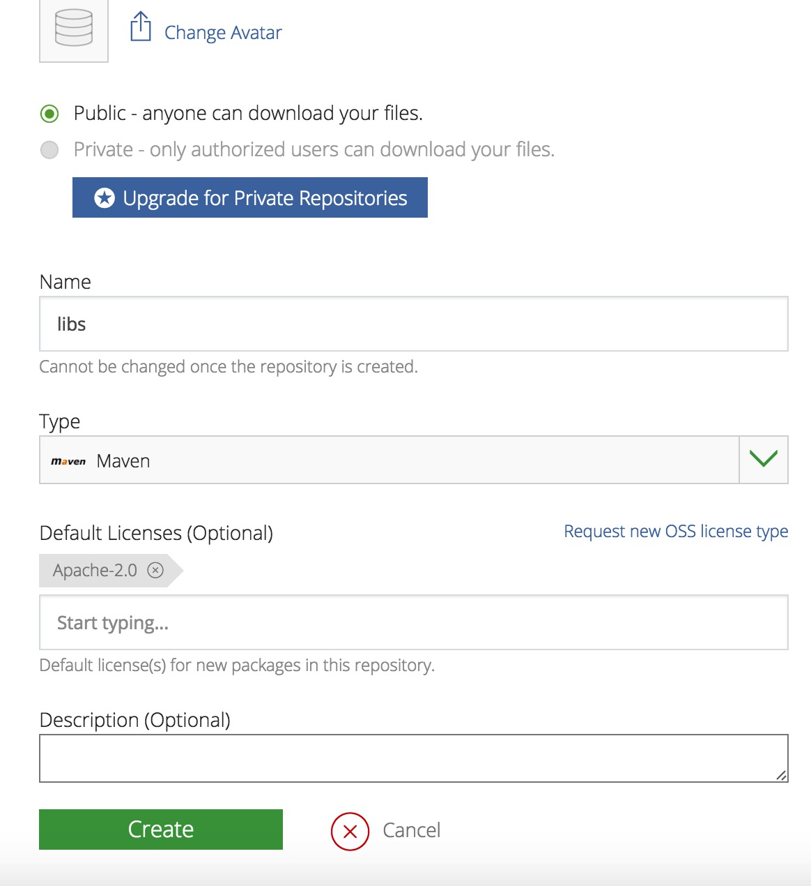
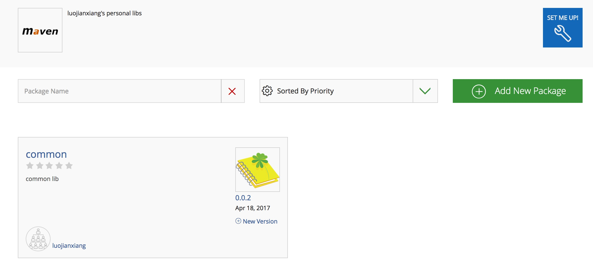
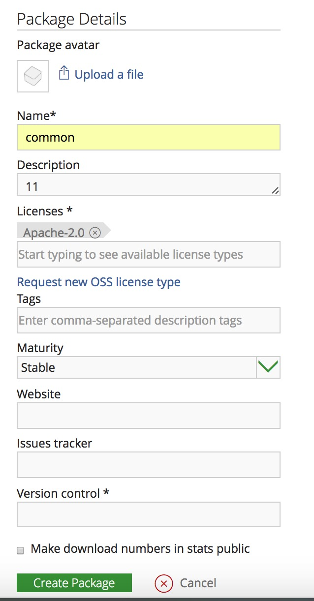
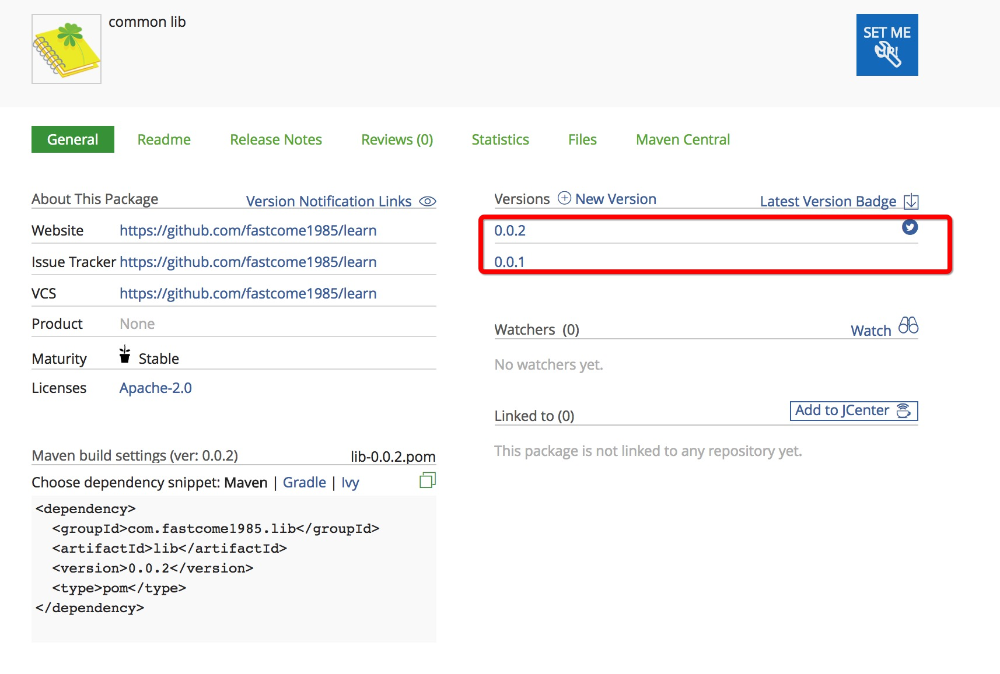
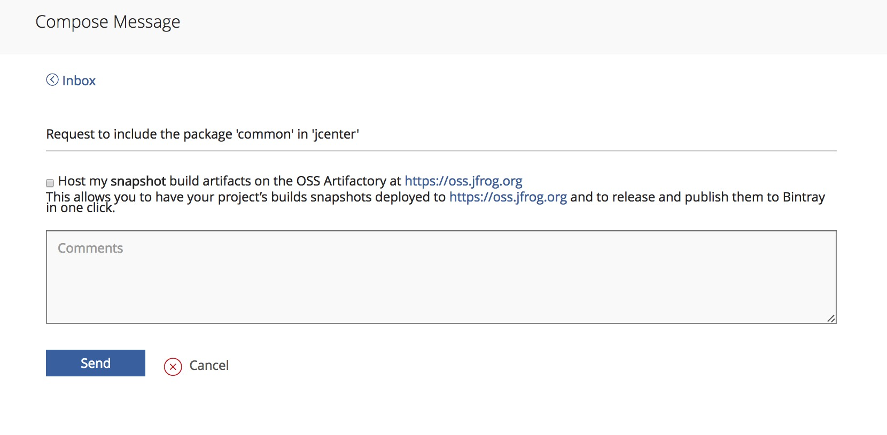

# Gradle使用
   书籍资料见  doc/gradle
   
   
## 内容   

### tasks
  Gradle编译以task为执行对象。

1. 在编译器右侧Gradle选项卡，可以看到各种tasks。

2. 一些常用tasks 
   * assemble 针对每个版本创建一个apk
   
   * clean 删除所有的构建任务，包含apk文件
   
   * check 执行Lint检查并且能够在Lint检测到错误后停止执行脚本
   
   * build 执行assemble和check

### 上传到maven库

#### 一、上传到jcenter
    
    见lib/uploadjcenter.gradle（要在build.gradle中apply from）
    
    
    
 1.  在[bintray](https://bintray.com/)注册账号(或者用github,google登录)

 2.  新建仓库（repository)（product不用建） 如libs,type选择maven  
 
     
     
     
 
 3.  点击刚刚新建的仓库，再点击adb new package添加package（ version control 建议用github ）
     
     
     
     
  
 4.  在项目根build.gradle添加
 
     classpath 'com.github.dcendents:android-maven-gradle-plugin:1.5'
 
     classpath "com.jfrog.bintray.gradle:gradle-bintray-plugin:1.5"
  
 5.  在lib下面新建uploadjcenter.gradle（具体配置代码）
     需要在lib下新建local.properies加入两行
     *  bintray.user=xxxxxxxx  (bintray的用户名)
     *  bintray.apikey=xxxxxxxxxx（bintray--edit profie----apikey）
     
     在build.gradle增加一行 apply from: 'uploadjcenter.gradle'
     
 6.  在as----terminal下运行
      ./gradlew install 
      如成功  接着运行
      ./gradlew bintrayUpload
 
     
 7.  上传成功后在后台可以看到上传的项目
      
     
     
     
 8.  点击页面右下方的 add to jcenter   发布到jcenter(大概一天过审核，审核后才能像其他类库一样可以依赖)
    
     add to jcenter的时候，下面的框不用勾
     
     
     
     
     
     
     
     
     