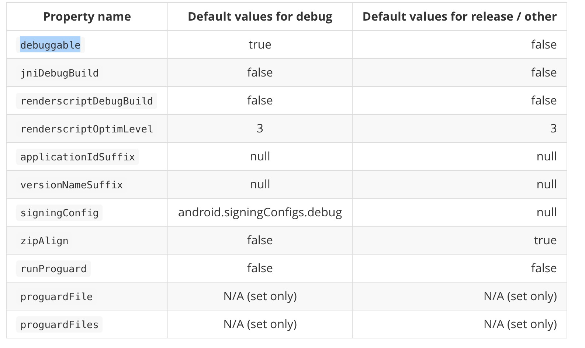
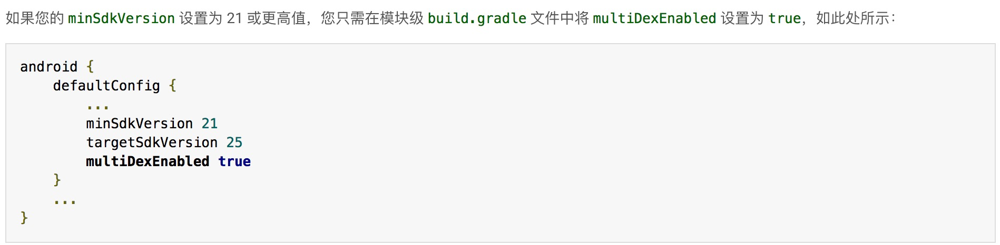

# Gradle使用
   书籍资料见  doc/gradle
   
   基本使用 [基本使用官网](https://developer.android.com/studio/build/application-id.html)
   
   
  
   
   
## 内容   

### tasks
  Gradle编译以task为执行对象。

1. 在编译器右侧Gradle选项卡，可以看到各种tasks。

2. 一些常用tasks 
   * assemble 针对每个版本创建一个apk
   
   * clean 删除所有的构建任务，包含apk文件
   
   * check 执行Lint检查并且能够在Lint检测到错误后停止执行脚本
   
   * build 执行assemble和check

### 常用属性

   
   
   *  applicationIdSuffix 可以为不同buildtype 添加后缀， 让不通的包装到同意设备
   
   *  versionNameSuffix 同上，可以标记beta等
  
   *  自定义属性  buildConfigField "boolean", "LOG_DEBUG", "true" 可以定义日志开关，或者线下线上请求地址等
  
   * 解决这些资源冲突的问题（引用module的时候）
   ```
    ndk {
               abiFilters "armeabi"
           }
   ```
   值打包armeabi下面的so库，减少包大小以及当值某个so库在某些文件夹下没有存放的BUG
   *
   ```
   packagingOptions {
           exclude 'META-INF/LICENSE.txt'
           exclude 'META-INF/NOTICE.txt'
           exclude 'META-INF/MANIFEST.MF'
       }
   ```
  
   * 过滤打包的资源 （详细见顶部的官网）
   ```
   android {
     ...
     splits {
   
       // Configures multiple APKs based on screen density.
       density {
   
         // Configures multiple APKs based on screen density.
         enable true
   
         // Specifies a list of screen densities Gradle should not create multiple APKs for.
         exclude "ldpi", "xxhdpi", "xxxhdpi"
   
         // Specifies a list of compatible screen size settings for the manifest.
         compatibleScreens 'small', 'normal', 'large', 'xlarge'
       }
     }
   }
   ```
   
   *  包括的资源
   ```
   dev {
         ...
         // The following configuration limits the "dev" flavor to using
         // English stringresources and xxhdpi screen-density resources.
         resConfigs "en", "xxhdpi"
       }
   ```
   
   
  


### 变量定义与使用

   rootProject 代表根目录路径
   
   project 当前module路径

  1. ext方法：
  
   * 在目录下新建文件config.gragle
      
   * 在config.gradle下增
   
   ```
     ext {
         android = [
                 compileSdkVersion: 25,
                 buildToolsVersion: "25.0.1",
                 minSdkVersion    : 15,
                 targetSdkVersion : 25
         ]
     
     
         dependencies = [ supportv4  : 'com.android.support:support-v4:25.2.0',
                          cardviewv7 : 'com.android.support:cardview-v7:25.2.0',
                          supportv7 :'com.android.support:appcompat-v7:25.2.0'
         ]
     
     }
   ```
     
   * 引用
  
   apply from: 'config.gradle'
  
  
   ```
    compileSdkVersion rootProject.ext.android.compileSdkVersion
    buildToolsVersion rootProject.ext.android.buildToolsVersion
    
    compile rootProject.ext.dependencies.supportv4
    compile rootProject.ext.dependencies.cardviewv7
    compile rootProject.ext.dependencies.supportv7
   ```
   
   
   
 2. gradle.properties文件方法
   
   例子：
   
   在gradle.properties（各个module都可以有）文件中定义GradleVersion=com.android.tools.build:gradle:2.2.3
   
   在根目录build.gradle引用  classpath project.property("GradleVersion")
   
   
   
 3. 使用场景举例
   
   使用的最多的场景是：项目下多个module使用统一的compileSdkVersion buildToolsVersion可以有两种思路：1、如上面在config或者gradle.properties中定义。2、直接全部定义好apply from:
   
     
### 依赖管理

   依赖分为5种：
   
   
   * compile  是默认的那个，其含义是包含所有的依赖包，即在APK里，compile的依赖会存在。

   * apk  apk中存在，但是不会加入编译中，这个貌似用的比较少。

   * provided 提供编译支持，但是不会写入apk。

   * testCompile 针对测试

   * androidTestCompile 针对测试
 
 
   常用：debugCompile  releaseCompile 用于分开依赖
   
   debugCompile 'com.squareup.leakcanary:leakcanary-android:1.5'
   
   releaseCompile 'com.squareup.leakcanary:leakcanary-android-no-op:1.5'

   provided 常用于编译是注解 参照dragger2

### 构建变体
    
   1. 多渠道打包（见多渠道打包）
   
   2. 打不通功能的包，入免费版与收费版
   
   * 可以通过builetype applicationIdSuffix， free  nofree实现
   
   * 通过productFlavors实现
   ```
      productFlavors {
          free {
            applicationId 'com.example.myapp.free'
          }
      
          paid {
            applicationId 'com.example.myapp.paid'
          }
        }
   ```

### tips
   *  方法数64K限制
      
      


### 上传到maven库

#### 一、上传到jcenter
    
见lib/uploadjcenter.gradle（要在build.gradle中apply from）
    
    
    
 1.  在[bintray](https://bintray.com/)注册账号(或者用github,google登录)

 2.  新建仓库（repository)（product不用建） 如libs,type选择maven  
 
     
     
     
 
 3.  点击刚刚新建的仓库，再点击adb new package添加package（ version control 建议用github ）
     
     
     
     
  
 4.  在项目根build.gradle添加
 
     classpath 'com.github.dcendents:android-maven-gradle-plugin:1.5'
 
     classpath "com.jfrog.bintray.gradle:gradle-bintray-plugin:1.5"
  
 5.  在lib下面新建uploadjcenter.gradle（具体配置见代码）
     需要在lib下新建local.properies并加入两行
     *  bintray.user=xxxxxxxx  (bintray的用户名)
     *  bintray.apikey=xxxxxxxxxx（bintray--edit profie----apikey）
     *  在build.gradle增加一行 apply from: 'uploadjcenter.gradle'
     
 6.  在as----terminal下运行
      ./gradlew install 
      如成功  接着运行
      ./gradlew bintrayUpload
      （不行的话  需要先chmod 755 gradlew）
     
 7.  上传成功后在后台可以看到上传的项目
      
     
     
     
 8.  点击页面右下方的 add to jcenter   发布到jcenter(大概一天过审核，审核后才能像其他类库一样可以依赖)
    
     add to jcenter的时候，下面的框不用勾
     
     
     
     
#### 二、上传到本地maven仓库

   1.  本地maven仓库nexus搭建见doc/nexus
   2.  上传代码见lib/uploadnative.gradle
   3.   在lib/gradle.properties添加（不存在则创建）
        GROUP_ID=com.fastcome1985.lib
        ARTIFACT_ID=luo
        VERSION=0.0.5-SNAPSHOT
        RELEASE_REPOSITORY_URL=http://172.23.132.67:8081/repository/ljxrelease/
        SNAPSHOT_REPOSITORY_URL=http://172.23.132.67:8081/repository/ljxsnapshot3/
        USERNAME=ttt
        PASSWORD=ttt
        
        注：VERSION=0.0.5-SNAPSHOT，带-SNAPSHOT会传到SNAPSHOT_REPOSITORY_URL，不带则是release
     
   4. 双击右边的upload/uploadArchives  就可以上传了

#### 三、遗留问题
   1.  上传到jcenter 与本地仓库不能一起用，会编译不过

### 多渠道打包    
    
   1. 第一步 在AndroidManifest.xml里配置PlaceHolder
    
    ```
      <meta-data
         android:name="UMENG_CHANNEL"
         android:value="${UMENG_CHANNEL_VALUE}" />
    ```
         
   2. 在build.gradle设置productFlavors
   
   ```
    productFlavors {
            xiaomi {}
            _360 {}
            baidu {}
            wandoujia {}
        }  
    productFlavors.all { 
            flavor -> flavor.manifestPlaceholders = [UMENG_CHANNEL_VALUE: name] 
        }
   ```
   
   3. 直接执行 ./gradlew assembleRelease


   
   


    
     
     
     
     
     
     